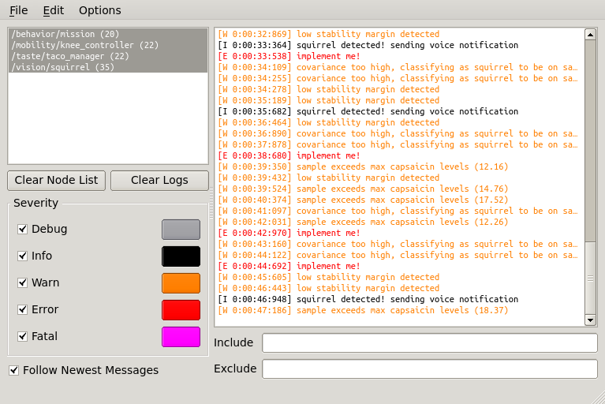

# swri_console

swri_console is an alternative to rqt_console for viewing the ROS console output.  swri_console was written to scale well to large systems with heavy console output.  It stays responsive under fire and allows users to quickly find information to track down problems.

