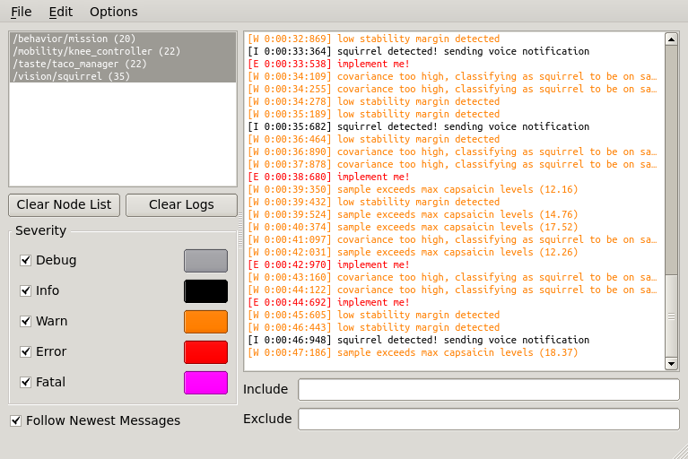

# swri_console

swri_console is an alternative to rqt_console for viewing the ROS console output.  swri_console was written to scale well to large systems with heavy console output.  It stays responsive under fire and allows users to quickly find information to track down problems.

Build Status
--------
ROS2 Distro | Branch | Build status | Released packages
:---------: | :----: | :----------: | :---------------:
**Humble** | [`humble`](https://github.com/swri-robotics/swri_console/tree/kilted-devel) |     | [swri-console](https://index.ros.org/p/swri_console/)
**Jazzy** | [`jazzy`](https://github.com/swri-robotics/swri_console/tree/kilted-devel) |     | [swri-console](https://index.ros.org/p/swri_console/)
**Kilted** | [`kilted`](https://github.com/swri-robotics/swri_console/tree/kilted-devel) |     | [swri-console](https://index.ros.org/p/swri_console/)
**Lyrical** | [`lyrical`](https://github.com/swri-robotics/swri_console/tree/ros2-devel) |     | [swri-console](https://index.ros.org/p/swri_console/)
**Rolling** | [`rolling`](https://github.com/swri-robotics/swri_console/tree/ros2-devel) |     | [swri-console](https://index.ros.org/p/swri_console/)

## Features

- High performance; swri_console handles receiving thousands of logs per second and storing millions in memory while staying responsive
- Ctrl or shift-click to quickly select which nodes you want to monitor
- Hide or show log messages based on substring matches, or, if you need more power, regular expressions
- Hide, show, and colorize log messages based on severity
- Save and load log messages to text files
- Save and load log messages directly from the `/rosout` topic in a bag file
- Right-click on nodes to dynamically set their logger levels
   - *Not supported in ROS 2 yet*
 
## Supported ROS Distributions
The package currently supports all ROS 2 distributions up to `rolling`. Branches marked `*-eol` indicate a distribution that is at end of life status and is no longer updated. As of `v2.1.2`, `humble`, `jazzy`, `kilted`, and `rolling` releases are bloomed from the `ros2-devel` branch.

